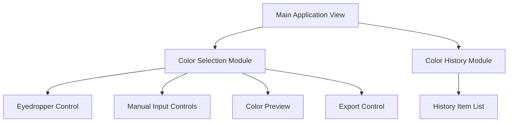
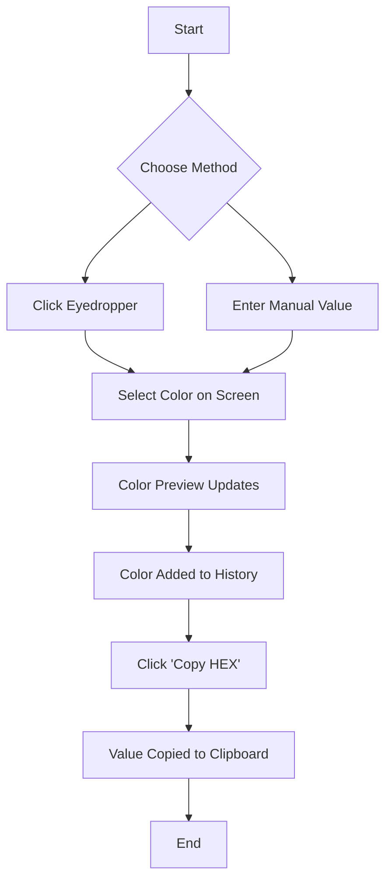

# Colour Picker UI/UX Specification

## Introduction

This document defines the user experience goals, information architecture, user flows, and visual design specifications for the Colour Picker's user interface. It builds upon the approved PRD to serve as the foundation for visual design and frontend development, ensuring a cohesive and user-centered experience.

### Overall UX Goals & Principles

#### Target User Personas

*   **The Professional Designer:** This user is a UI/UX or web designer who values speed, efficiency, and accuracy. They are a power user, comfortable with keyboard shortcuts and a dense, tool-like interface. They need to move quickly between inspiration, selection, and implementation.

#### Usability Goals

*   **Efficiency:** The core user flow of selecting a color and copying its value should be achievable in under 3 seconds.
*   **Clarity:** All interactive elements should be clearly labeled and their function immediately understandable. There should be no ambiguity.
*   **Learnability:** A new user should be able to master the tool's complete functionality within 2 minutes of use.

#### Design Principles

1.  **Speed as a Feature:** Prioritize performance and a responsive UI above all else. Every interaction should be instantaneous.
2.  **Tool, Not a Toy:** Design a professional, high-density interface that feels like a serious instrument for designers.
3.  **Clarity and Precision:** The UI must be unambiguous, providing clear feedback for every user action.

### Change Log

| Date | Version | Description | Author |
| :--- | :--- | :--- | :--- |
| 2025-10-04 | 1.0 | Initial UI/UX Specification draft created from PRD. | Sally, UX Expert |

## Information Architecture (IA)

As a single-page application, the information architecture is flat, contained within a single view. The hierarchy is organized by function.

### Site Map / Screen Inventory

## User Flows

### Core User Flow: Color Selection & Export

*   **User Goal:** To select a color and copy its value for use in another tool.
*   **Entry Points:** User loads the application.
*   **Success Criteria:** The user has the desired color code on their clipboard.

#### Flow Diagram

## Wireframes & Mockups

Detailed, high-fidelity mockups will be created in Figma. The conceptual layout for the main screen is as follows:

### Key Screen Layouts

#### Main Application View

*   **Purpose:** To provide a single, consolidated interface for all color picking and management tasks.
*   **Key Elements (arranged vertically):**
    1.  **Large Color Preview Swatch:** A prominent swatch showing the currently active color.
    2.  **Manual Input Group:** A section with labeled inputs for HEX, RGB, and HSL, along with the "Copy HEX" button.
    3.  **Eyedropper Button:** A clear call-to-action button to activate the screen picker.
    4.  **Color History Panel:** A scrollable list of previously selected color swatches.
*   **Interaction Notes:** The layout will be a single column on mobile/tablet and potentially a two-column layout on wide desktops, with the history panel sitting beside the main controls.

## Component Library / Design System

### Core Components

*   **ColorInput:** A labeled input field for a single color value (e.g., 'R', 'G', 'B').
*   **ColorSwatch:** A square or circular element that displays a solid color.
*   **IconButton:** A button that contains only an icon (e.g., for the eyedropper).
*   **HistoryItem:** A small ColorSwatch used in the history list, which sets the main color on click.
*   **CopyButton:** A button that copies text to the clipboard and provides visual feedback.

## Branding & Style Guide

### Visual Identity

The brand is minimal, modern, and professional. The UI should feel like a utility, with no unnecessary decoration.

### Color Palette

| Color Type | Hex Code | Usage |
| :--- | :--- | :--- |
| Primary | `#007AFF` | Interactive elements, buttons, focus indicators. |
| Success | `#34C759` | "Copied!" confirmation text. |
| Error | `#FF3B30` | Error states on input fields. |
| Neutral | `#1C1C1E`, `#636366`, `#F2F2F7` | Backgrounds, borders, and text (dark mode first). |

### Typography

*   **Primary Font:** Inter (a clean, highly legible sans-serif suitable for UI).
*   **Monospace:** Roboto Mono (for displaying color codes).

| Element | Size | Weight | Line Height |
| :--- | :--- | :--- | :--- |
| H1 | 24px | Bold | 1.2 |
| Body | 16px | Regular | 1.5 |
| Small | 12px | Regular | 1.5 |

## Accessibility Requirements

### Compliance Target

*   **Standard:** WCAG 2.1 Level AA.

### Key Requirements

*   **Visual:** All text must have a contrast ratio of at least 4.5:1 against its background. All interactive elements must have clear, visible focus indicators.
*   **Interaction:** All functionality must be operable via keyboard. All controls must be properly labeled for screen readers.

## Next Steps

### Immediate Actions

1.  Review and approve this UI/UX Specification.
2.  Create high-fidelity mockups in Figma based on these specifications.
3.  Handoff this document and the mockups to the Architect and development team.
